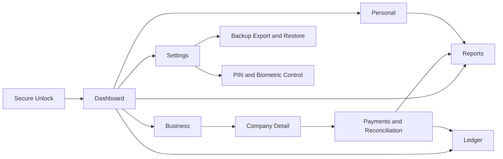
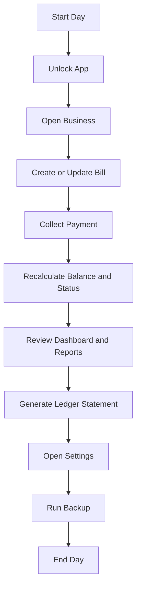

# VEE AGENCY PROJECT - COMPLETE DESIGN DOCUMENTATION

## 1. Design Overview

VEE Agency is designed as a calm, practical financial workspace where clarity matters more than visual noise. The interface is intentionally structured to support frequent, repetitive business tasks such as tracking bills, checking balances, recording payments, generating statements, and reviewing spending. Instead of trying to look decorative, the product design emphasizes confidence, readability, and operational speed.

At a high level, the design combines three complementary personalities:

1. Interactive workspace design for day-to-day data entry and monitoring.
2. Formal print-document design for ledger output and business communication.
3. Mobile-first quick-navigation design for fast, repeat actions on Android.

This multi-mode character is one of the strongest design outcomes in the project. On screen, users get lightweight cards, compact tables, and direct actions. On mobile, they get icon-first quick navigation and thumb-friendly targets. On paper, they get structured, high-contrast, professional statement layouts with clear accounting semantics.

---

## 2. Core Design Intent

The design appears to follow five practical intents:

1. Keep users oriented at all times.
2. Reduce friction for repeated financial actions.
3. Make numeric information easy to scan and compare.
4. Build trust through consistent structure.
5. Support both mobile and desktop without changing the mental model.

Every major interface decision reflects these intents. There are no sudden visual shifts between modules, and users can predict where information and actions will appear.

---

## 3. Visual Identity and Tone

The visual tone is best described as enterprise-clean with understated confidence. It does not lean heavily into trendy gradients, dramatic shadows, or expressive illustration. Instead, it uses muted neutrals, controlled emphasis colors, and clear spacing to communicate reliability.

Design personality traits:

1. Quiet and disciplined.
2. Utility-first.
3. Professional rather than playful.
4. Data-led and text-friendly.

This identity is a strong match for bookkeeping and billing workflows where users prioritize correctness and speed over entertainment.

---

## 4. Color Strategy

The color language uses semantic roles rather than arbitrary palettes. This helps users interpret meaning quickly:

1. Neutral backgrounds to reduce fatigue in long sessions.
2. Strong foreground contrast for readability.
3. Primary color for active navigation and key actions.
4. Destructive color for risk, pending balances, and financial warnings.
5. Muted tones for secondary labels and contextual information.

The result is a hierarchy where important values stand out naturally without aggressive visual effects. Particularly in financial interfaces, this kind of restraint improves confidence and reduces cognitive burden.

---

## 5. Typography and Readability

Typography emphasizes legibility and rhythm:

1. Sans-serif body and interface text for clarity in dense UI.
2. Clear size jumps between headings, values, labels, and helper text.
3. Strong weight contrasts for key numbers and totals.
4. Conservative line heights for compact but readable data displays.

The typographic approach supports fast scan behavior. Users can quickly identify:

1. Page purpose.
2. Summary totals.
3. Status labels.
4. Inline row details.

This is essential in screens with mixed data granularity such as dashboard cards and tables.

---

## 6. Layout Philosophy

The layout system uses a stable shell model:

1. Persistent top navigation.
2. Consistent content container width.
3. Predictable spacing between sections.
4. Repeated visual primitives across pages.

This design creates continuity. Even when moving between dashboard, business, personal, reports, and settings views, users feel they are still inside one coherent workspace.

The spacing pattern is modular and balanced. Sections are visually separated enough to avoid clutter, but not so far apart that scrolling feels wasteful.

---

## 7. Navigation Design Method

Navigation is one of the strongest design decisions in the project. The method is explicit, route-based, and low-friction.

### 7.1 Structure

Top-level destinations are visible and understandable:

1. Dashboard.
2. Business.
3. Companies.
4. Ledger.
5. Personal.
6. Reports.
7. Settings.

This structure avoids hidden complexity and reduces decision effort.

### 7.2 Interaction

1. Active route has clear visual emphasis.
2. Inactive links remain visible but calm.
3. Hover states communicate immediate affordance.
4. Mobile menu opens and closes predictably.
5. Desktop quick-nav keeps high-frequency destinations one click away.
6. Mobile bottom quick-nav keeps high-frequency destinations one tap away.

### 7.3 Why It Works

1. Fast orientation.
2. Minimal cognitive overhead.
3. Easy route memory over time.
4. Strong compatibility with repetitive workflows.

### 7.4 Mobile Adaptation

The mobile navigation pattern keeps the same information architecture while changing presentation:

1. Compact toggle entry.
2. Vertical link stack for thumb-friendly tapping.
3. Auto-close behavior on route change.
4. Persistent bottom quick-nav for repeated daily loops.

This preserves familiarity while respecting limited screen space.

---

## 8. Dashboard Design

The dashboard is designed for rapid situational awareness. It uses cards and compact lists to answer first-order questions quickly:

1. How much total business value exists?
2. How much is paid?
3. How much is outstanding?
4. What is recent spending behavior?

Design strengths:

1. Clear card hierarchy.
2. Good icon + label pairing.
3. Balanced density for quick scanning.
4. Immediate action paths to business and personal workflows.

The dashboard avoids overloading charts at the top level. Instead, it uses concise summaries and directs deeper analysis to dedicated pages.

---

## 9. Business Module Design

The business section blends table-heavy data management with inline action design.

### 9.1 Table Readability

1. Strong column labels.
2. Numeric alignment for financial fields.
3. Status badges for quick state detection.
4. Row hover and expansion behavior for contextual detail.

### 9.2 Progressive Disclosure

Expandable rows reveal payment logs and payment actions only when needed. This keeps the base table clean while preserving depth.

### 9.3 Action Design

1. Ledger action is visible at row level.
2. Add payment area appears directly in context.
3. Inline edit controls avoid page detours.

This is a practical design for operations teams that need to process many records quickly.

---

## 10. Company Management Design

Company management uses straightforward form-table composition:

1. Form at top for create/edit.
2. List below for scanning and management.
3. Small action buttons for edit/delete at row end.

This pattern is familiar and efficient. It reduces learning time and supports frequent data corrections.

The field set reflects business identity needs without visual clutter. The design focuses on form clarity rather than decorative input styling.

---

## 11. Personal Expense Design

Personal expense screens mirror business visual logic while preserving distinct content identity.

1. Summary cards for totals and trends.
2. Category cards for quick distribution insight.
3. Table for transaction-level review.

The reuse of shared visual patterns makes the transition between business and personal modules smooth. Users do not need to relearn interaction styles.

---

## 12. Reports Design

Reports uses visual analytics in a restrained way.

1. Bar chart for business paid vs balance comparisons.
2. Pie chart for category distribution.
3. Supporting text breakdown for exact amounts and percentages.

Design choice here is important: charts are supported by textual context, avoiding the common problem where visuals are pretty but ambiguous. This balance supports both quick impressions and exact interpretation.

---

## 13. Ledger Print Design

The ledger print subsystem expresses a completely different design mode: formal document output.

### 13.1 Visual Goals

1. Professional presentation.
2. Accounting-friendly structure.
3. High contrast for print legibility.
4. Signature and approval readiness.

### 13.2 Document Composition

1. Company header.
2. Client identity block.
3. Date range block.
4. Transaction table with debit/credit/balance.
5. Summary totals section.
6. Signature and stamp spaces.
7. Footer statements.

### 13.3 Why This Matters

Most internal apps fail when users need real-world paperwork. This design solves that by treating print output as first-class, not an afterthought.

---

## 14. Iconography and Symbol Design

Icons are used as lightweight orientation cues, not decorative excess.

Principles observed:

1. Simple line icons.
2. Consistent weight and scale.
3. Paired with text for disambiguation.
4. Used to accelerate recognition in dense interfaces.

This supports quick scanning and lowers interpretation error, especially for mixed-experience users.

---

## 15. Component Consistency

The design system relies on repeated primitives:

1. Cards.
2. Tables.
3. Badges.
4. Buttons.
5. Dialogs.

Consistency benefits:

1. Reduced mental switching cost.
2. Faster onboarding.
3. Predictable interaction behavior.
4. Stronger perception of product quality.

A user who learns one page can operate others with minimal friction.

---

## 16. Interaction Feedback Design

Feedback is immediate and concise:

1. Toast messages for confirmation and validation errors.
2. Disabled states for unavailable actions.
3. Distinct status colors for payment state.
4. Progress cues where relevant.

The feedback style is functional and not intrusive. It supports correction without breaking task flow.

---

## 17. Data Density and Scanability

Financial interfaces often become visually heavy. This design handles density through:

1. Sectioned spacing.
2. Text hierarchy.
3. Numeric alignment.
4. Controlled card grouping.
5. Progressive disclosure for details.

As a result, the interface remains readable even with many records.

---

## 18. Responsive Design Character

Responsive behavior is adaptive, not radically transformed. The same content model remains available across devices, while layout shifts to suit screen width.

Desktop:

1. Wider card grids.
2. Horizontal nav.
3. Larger simultaneous context visibility.

Mobile:

1. Vertical stacking.
2. Menu toggle navigation.
3. Touch-friendly spacing.

This continuity supports users who switch between desktop and Android frequently.

---

## 19. Trust and Professionalism Signals

The design communicates trust in several ways:

1. Stable structure.
2. Consistent visual grammar.
3. Explicit status indicators.
4. Formal print outputs.
5. Security-oriented settings surfaces.

Together, these choices make the app feel dependable, which is critical when users manage financial records.

---

## 20. Design Strengths Summary

Key strengths of the current design:

1. Practical and coherent navigation model.
2. High readability for financial values.
3. Strong form-table-card component consistency.
4. Effective dual-mode design (interactive + print).
5. Clear visual hierarchy with restrained emphasis.
6. Mobile adaptation without mental-model break.

---

## 21. Design Improvement Opportunities

Without changing the overall identity, design can be further elevated with:

1. More explicit keyboard-focus styling for accessibility confidence.
2. Optional compact mode for dense data workflows.
3. In-navigation badges for urgent pending counts.
4. Slightly richer empty-state illustrations or guidance text.
5. More consistent currency symbol presentation across all modules.
6. Print style refinements for exact spacing and alignment precision.

These are incremental improvements, not structural redesign requirements.

---

## 22. Final Design Conclusion

VEE Agency demonstrates a strong functional design mindset. It prioritizes clarity, consistency, and operational flow over decoration, which is exactly what this category of product needs. The interface feels deliberate, dependable, and efficient for real financial tasks. The navigation framework is especially effective, and the print-ledger design provides real business value beyond typical dashboard applications.

As a design system, the project is already solid and production-friendly. With small refinements, it can become an exemplary model of practical financial UI design for both screen and document workflows.

---

## 23. End-to-End Operational Flow (Updated)

This section defines the practical user flow across the current implementation, from secure entry to reporting and backup.

### 23.1 Flow A: Secure Entry and Session Start

1. User opens the app.
2. App lock gate appears when lock is enabled.
3. User unlocks with PIN or biometrics.
4. User lands on Dashboard with current business and expense summaries.

### 23.2 Flow B: Daily Business Billing Cycle

1. User opens Business.
2. User adds a company (if needed) and creates bill entries.
3. User reviews table status (paid, pending, completed).
4. User opens company detail to continue transaction handling.

### 23.3 Flow C: Company Reconciliation Loop

1. User selects a company row from Business.
2. User adds bill-linked or direct transactions.
3. User reviews bill-level payment history.
4. User updates or removes incorrect payment entries.
5. System recalculates paid and balance totals.

### 23.4 Flow D: Ledger and Document Output

1. User navigates to Ledger.
2. User selects bill context.
3. User verifies print layout fields (header, GST, bank details, totals).
4. User prints statement or saves a document copy.

### 23.5 Flow E: Personal and Reporting Review

1. User opens Personal to log or review expense entries.
2. User opens Reports for business and personal trend visibility.
3. User uses chart plus text summaries for quick and exact interpretation.

### 23.6 Flow F: Data Protection and Recovery

1. User opens Settings.
2. User configures fingerprint and PIN behavior.
3. User exports encrypted backup payload.
4. User restores backup when moving devices or recovering records.

### 23.7 Flow Quality Notes

1. The flow is intentionally short, repetitive, and predictable.
2. Navigation continuity reduces context switching between modules.
3. Core finance actions can be completed from mobile without changing the mental model.
4. Print and backup are treated as primary flows, not optional extras.

### 23.8 Visual Flow Diagram: Navigation and Module Movement

### 23.9 Visual Flow Diagram: Daily Operational Cycle

