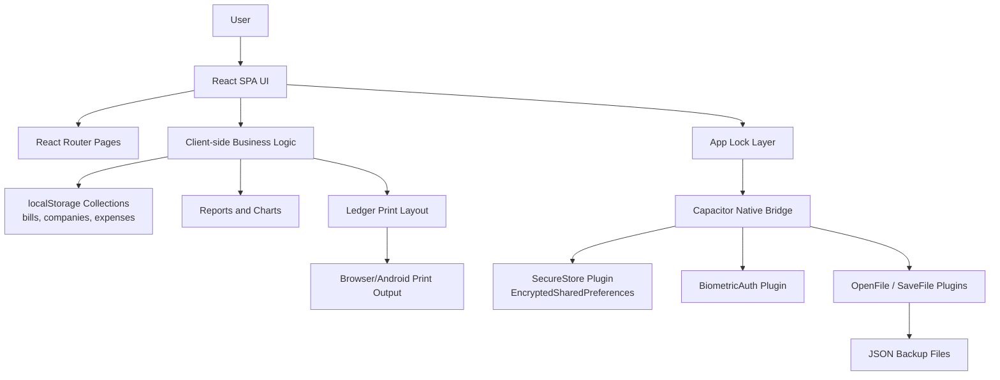
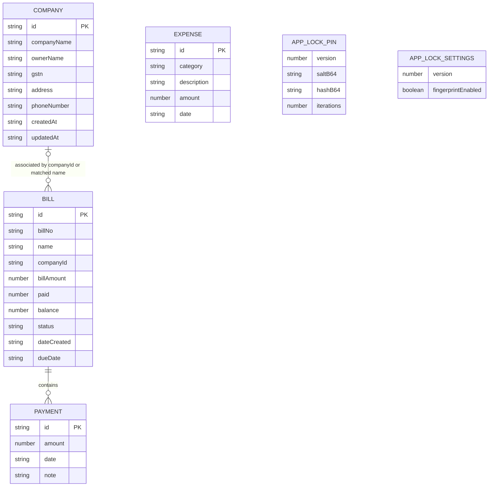
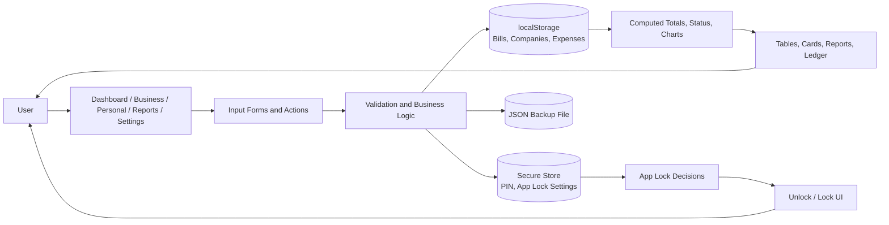
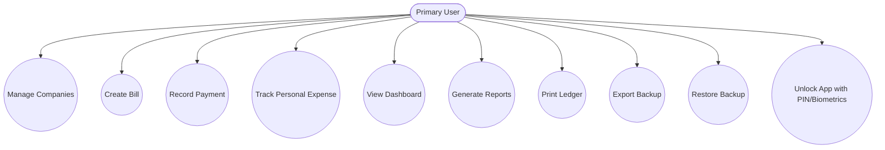
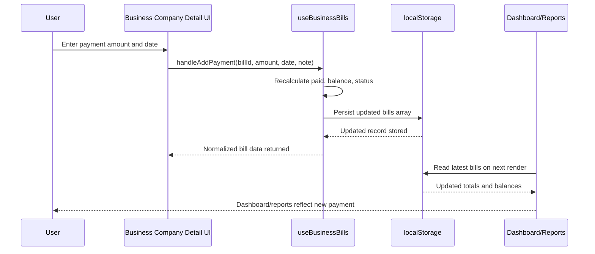
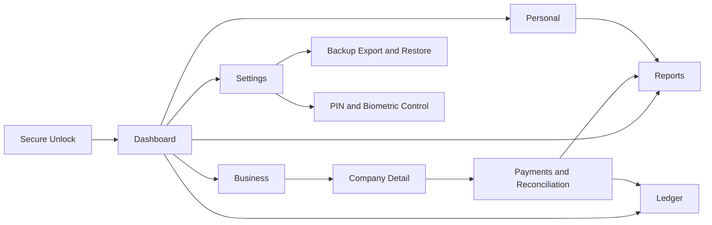
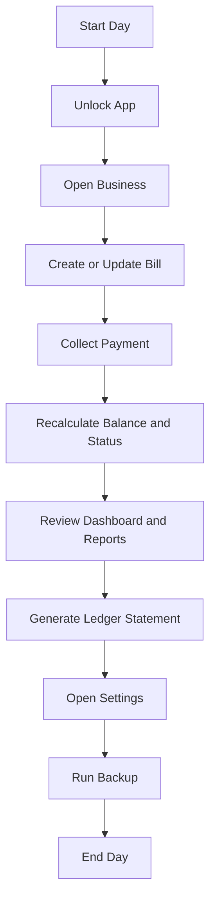

# VEE AGENCY PROJECT FULL DOCUMENTATION

This master document compiles the project's complete technical, backend-context, billing, and design documentation.


---

# Section 1: Project Report

# TITLE

**VEE Agency (Expense Compass): Billing and Enterprise Management System**

Project Report on a Local-First Billing, Expense Tracking, Ledger Printing, and Secure Android-Assisted Financial Management Application

---

# ABSTRACT

VEE Agency, branded in parts of the codebase as Expense Compass, is a finance-oriented business application designed to centralize billing operations, company management, payment tracking, personal expense monitoring, reporting, ledger generation, backup, and device-level security in a single system. The project addresses a common small-business problem: financial records are often scattered across notebooks, spreadsheets, chats, and informal follow-up methods, which causes poor visibility into receivables, delayed reconciliations, duplicated data entry, and weak audit readiness.

The implemented solution is a React 18 + TypeScript single-page application built with Vite and enhanced for Android through Capacitor. The system is intentionally local-first. Business bills, companies, and expenses are stored in browser `localStorage`, while security-sensitive settings such as the app-lock PIN and biometric preferences are stored through a native encrypted storage plugin on Android. The application includes a dashboard for quick financial overview, a business billing module for receivable tracking, a companies module for master data management, a personal expense module for category-based monitoring, a reports module with charts, a ledger print module for formal A4 statements, and a settings module for PIN management and full backup/restore.

From a software engineering perspective, the project is notable for combining an SPA architecture, offline-friendly persistence, native security plugins, and print-first document output without requiring a backend server. At the same time, the repository also reveals current limitations that are important in an academic report: there is no centralized database, no multi-user role model, no inventory subsystem, no backend APIs, and some UI affordances such as PDF/Excel export buttons are currently placeholders rather than full export pipelines. Overall, the project demonstrates a strong applied implementation for small-scale financial operations, especially where low infrastructure cost, operational simplicity, and mobile-assisted local usage are important.

---

# LIST OF TABLES

1. Table 1. Technology Stack and Runtime Profile
2. Table 2. Major Functional Modules
3. Table 3. Environment and Deployment Requirements
4. Table 4. Functional Requirements
5. Table 5. Non-Functional Requirements
6. Table 6. Core Business Rules and Logic
7. Table 7. Input and Validation Summary
8. Table 8. Logical Data Collections and Storage Keys
9. Table 9. System Testing Matrix
10. Table 10. Mapping of Project Goals to SDG

---

# LIST OF FIGURES

1. Figure 1. High Level Architecture Diagram
2. Figure 2. ER Diagram
3. Figure 3. Dataflow Diagram
4. Figure 4. Use Case Diagram
5. Figure 5. Sequence Diagram

---

# INTRODUCTION

## 1.1 OVERVIEW OF THE PROJECT

VEE Agency is a billing and enterprise management application intended to help a small or medium business maintain financial clarity with minimal operational friction. The system combines day-to-day bill tracking with expense recording, reporting, and professional ledger output. Instead of using a client-server model, the implemented repository follows a local-first design in which the application executes all business logic on the client side and persists data within the device or browser environment.

The application supports the following core business capabilities:

1. Company master data maintenance.
2. Bill creation with auto-generated due dates.
3. Payment recording, editing, and deletion.
4. Automatic paid/balance/status recalculation.
5. Personal expense tracking with category summaries.
6. Visual reporting using business and expense charts.
7. Ledger statement generation and printing.
8. Device-level security using a 4-digit PIN and Android biometrics.
9. Backup and restore of application data.

The codebase indicates two product identities:

1. `Expense Compass` is the user-facing name visible in the README, storage keys, backup filenames, and security text.
2. `VEE Agency` is the design/documentation identity used in project documentation and default ledger branding.

This report treats both names as the same project implementation.

**Table 1. Technology Stack and Runtime Profile**

| Layer | Technology | Role in System |
| --- | --- | --- |
| Frontend framework | React 18 | Component-based SPA implementation |
| Language | TypeScript 5 | Strong typing for pages, hooks, models, and security payloads |
| Build tool | Vite 5 | Fast development server and production build pipeline |
| Routing | React Router 6 | Page-level navigation between dashboard, business, companies, ledger, personal, reports, and settings |
| UI system | Tailwind CSS, shadcn/ui, Radix UI | Reusable and responsive user interface construction |
| Charts | Recharts | Bar and pie visual analytics for business and expense reports |
| Date utilities | date-fns | Human-readable date formatting and date calculations |
| State persistence | `localStorage` via custom hook | Local-first storage of bills, companies, and expenses |
| Native wrapper | Capacitor 8 | Android packaging and native plugin bridge |
| Native security | EncryptedSharedPreferences, Android Biometric | Secure storage of PIN/settings and biometric unlock |
| File operations | Custom Capacitor plugins | Backup export and restore using Android file pickers |
| Quality tooling | ESLint, TypeScript compiler | Static correctness and code quality checks |

## 1.2 OBJECTIVES

The primary objectives of the project are:

1. To centralize business billing, payment tracking, and company information in one application.
2. To provide real-time visibility into total receivables, paid amounts, pending balances, and spending.
3. To reduce manual reconciliation effort by automatically recalculating balances and payment status.
4. To maintain a lightweight solution that works without backend infrastructure.
5. To support both browser usage and Android-assisted native usage through Capacitor.
6. To improve trust and document readiness through professional ledger print layouts.
7. To protect financial data on Android devices through PIN-based and biometric access control.
8. To support continuity of operations through full backup and restore.
9. To provide a system architecture that is extensible for future enterprise features such as APIs, inventory, multi-user access, and cloud synchronization.

## 1.3 SYSTEM STUDY

The project can be studied from four complementary angles: domain study, implementation study, feasibility study, and user-operation study.

### Domain Study

The target problem space is receivable and expense management for a small business. The repository strongly suggests a workflow centered on business owners, billing operators, or accounts staff. This role interpretation is an inference from the implemented features because the application does not include a user-role database or multi-user login. The application emphasizes:

1. Bill creation and payment follow-up.
2. Company identity and GST-related business records.
3. Outstanding balance monitoring.
4. Personal or operational expense logging.
5. Ledger generation for accounting communication.

### Implementation Study

The codebase reveals a component-oriented SPA where:

1. Routes are declared in `src/App.tsx`.
2. Persistent local state is handled by `src/hooks/useLocalStorageState.ts`.
3. Billing logic is centralized in `src/hooks/useBusinessBills.ts`.
4. Security lock behavior is handled through `src/security/useAppLock.ts` and `src/security/AppLockGate.tsx`.
5. Native Android capabilities are exposed through custom Capacitor plugins registered in `android/app/src/main/java/com/expensecompass/app/MainActivity.java`.

### Feasibility Study

The implementation is technically feasible because it avoids backend dependency, uses widely adopted frontend tooling, and packages the same codebase for Android with Capacitor. It is operationally feasible because navigation and module boundaries are straightforward. It is economically feasible for small deployments because there is no server hosting or database administration requirement. However, the same design choice also limits scalability, cross-device synchronization, centralized audit control, and collaborative access.

### User-Operation Study

The implemented workflows show a repetitive operational pattern:

1. Add or locate a company.
2. Create a bill for that company.
3. Record one or more payments over time.
4. Monitor balance and status changes.
5. View dashboards and reports.
6. Print or export a ledger when formal documentation is needed.
7. Backup data periodically.

## 1.4 PROBLEM DESCRIPTION

In many small business settings, billing and payment records are maintained manually or semi-digitally across multiple disconnected tools. Typical problems include:

1. Bills are created in one place but payments are tracked elsewhere.
2. Company details are inconsistent or duplicated.
3. Balance status is calculated manually, increasing the risk of error.
4. Outstanding bills are not visible in a timely manner.
5. Personal or operational expenses are not analyzed by category.
6. Ledger statements are difficult to prepare in a formal, printable layout.
7. Sensitive financial data may remain unprotected on shared or mobile devices.
8. Data loss risk increases when no structured backup mechanism exists.

The project addresses these problems by replacing fragmented financial record-keeping with a unified, local-first operational system.

---

# SYSTEM ANALYSIS

## 2.1 EXISTING SYSTEM

The existing system, in a business context prior to using this application, can be characterized as a manual or loosely digital process with the following properties:

1. Companies, invoices, and payments are often tracked in notebooks or spreadsheets.
2. Outstanding balances are computed manually.
3. Payment history may be incomplete or difficult to audit.
4. Ledger statements are either handwritten, assembled manually, or recreated from scattered data.
5. Expense tracking is rarely integrated with billing analysis.
6. Data security is weak because records may live in plain files or unlocked devices.
7. Backups depend on ad hoc copying rather than a structured export mechanism.

From an information systems perspective, the existing system is low-cost initially but high-friction over time because the overhead of correction, reconciliation, and reporting grows with data volume.

## 2.2 PROPOSED SYSTEM

The proposed system implemented in this repository is a unified, local-first financial workspace that provides a single operational surface for billing, companies, expenses, reporting, ledger printing, and Android device security.

Key characteristics of the proposed system are:

1. Single-page application architecture for fast navigation.
2. Local data persistence for offline-friendly usage.
3. Reusable shared UI patterns across modules.
4. Automated business logic for balances, statuses, and due dates.
5. Native Android integration for secure storage, biometrics, and file access.
6. Print-first ledger generation for business communication.

**Table 2. Major Functional Modules**

| Module | Core Responsibilities | Current Status |
| --- | --- | --- |
| Dashboard | High-level bill, payment, outstanding, and expense overview | Implemented |
| Business Bills | Create bills, group by company, monitor payment state | Implemented |
| Company Management | Create, edit, delete company master records | Implemented |
| Company Detail | Company-wise bill view, direct transaction entry, company report | Implemented |
| Personal Expenses | Add, edit, delete expenses and analyze by category | Implemented |
| Reports | Bar and pie chart based financial summaries | Implemented |
| Ledger | Bill-wise printable ledger statement | Implemented |
| Security | PIN setup, PIN verification, biometric unlock on Android | Implemented |
| Backup and Restore | Export/import JSON backups including secure settings | Implemented |
| PDF/Excel data export buttons | Quick export controls in UI | Partially implemented, current callbacks default to toast placeholders |
| Inventory/Product management | Product catalog and stock logic | Not implemented |
| Backend API integration | Remote storage, sync, multi-device collaboration | Not implemented |

## 2.3 HIGH LEVEL ARCHITECTURE DIAGRAM

**Figure 1. High Level Architecture Diagram**



### Architecture Interpretation

The diagram shows that the application is not divided into frontend and backend servers. Instead, all business operations execute in the client runtime. This reduces infrastructure complexity and enables offline-first behavior, but also means:

1. Data is device-local by default.
2. Collaboration across users is not natively supported.
3. Security depends heavily on device access and local storage practices.
4. Large-scale enterprise governance would require future backend integration.

## 2.4 ER DIAGRAM

**Figure 2. ER Diagram**



### ER Analysis

The logical model shows the most important structural characteristic of the system: it does not use a relational database engine. Instead:

1. `Bill -> Payment` is a strong embedded one-to-many relationship.
2. `Company -> Bill` is a soft relationship, because bills may reference `companyId`, company name, or both.
3. `Expense` is independent from billing entities.
4. Security entities are stored separately from general app data.

This design is simple and practical for local operation, but the soft company relationship introduces a possible data quality risk if names are changed after bills are created.

## 2.5 DATAFLOW DIAGRAM

**Figure 3. Dataflow Diagram**



### DFD Interpretation

The dataflow of the system is direct and compact:

1. Users submit data through UI forms.
2. Client-side validation and business logic process the data.
3. Persistent state is stored either in `localStorage`, secure native storage, or backup files.
4. Computed summaries and reports are derived directly from stored data.

## 2.5.1 USE CASE DIAGRAM

**Figure 4. Use Case Diagram**



## 2.5.2 SEQUENCE DIAGRAM

**Figure 5. Sequence Diagram**



## 2.6 USER JOURNEY AND WORKFLOWS

The user journey is intentionally short, repetitive, and low-friction. The main workflows are described below.

### Workflow A: First-Time Secure Access on Android

1. User opens the application on an Android device.
2. `AppLockGate` overlays the application.
3. If no PIN exists, the user creates and confirms a 4-digit PIN.
4. The PIN is transformed into a PBKDF2-SHA256 payload with salt and iteration count.
5. The payload is stored in encrypted native storage.
6. On subsequent launches or app resume events, the user unlocks using biometrics or PIN.

### Workflow B: Company and Bill Creation

1. User creates a company from the Companies page or directly from the Add Bill dialog.
2. User enters company details such as name, owner, GSTN, address, and phone.
3. User opens the Add Bill dialog.
4. User selects or types a company name, enters bill number, bill amount, and creation date.
5. The system automatically calculates the due date as 30 days from creation date.
6. The new bill is saved and surfaced in business summaries.

### Workflow C: Payment Collection and Reconciliation

1. User opens the company detail screen or bill table.
2. User expands a bill to view payment history.
3. User records a payment with amount and date.
4. The application blocks overpayment if the new paid total exceeds bill amount.
5. Balance and status are recalculated instantly.
6. Dashboard, reports, and company summaries reflect the new state.

### Workflow D: Expense Recording

1. User opens the Personal module.
2. User enters category, description, amount, and date.
3. The expense is persisted locally.
4. Summary cards, category totals, and charts update automatically.

### Workflow E: Ledger and Reporting

1. User views the Reports page for visual financial analysis.
2. User opens a bill-specific ledger from the business table or the dedicated ledger page.
3. The system generates a print-friendly ledger with debit, credit, and running balance.
4. User prints directly or saves through browser or Android print workflows.

### Workflow F: Backup and Recovery

1. User opens Settings.
2. User exports a JSON backup containing business data and secure app-lock data.
3. On web, a file download is created.
4. On Android, a native file picker saves the backup and can optionally share it.
5. For restore, the application reads the selected JSON file and overwrites current app data.

## 2.7 SYSTEM REQUIREMENTS

The system requirements can be interpreted in two layers:

1. Environment requirements needed to run or build the application.
2. Functional and non-functional requirements needed to satisfy user and business needs.

**Table 3. Environment and Deployment Requirements**

| Category | Requirement | Notes |
| --- | --- | --- |
| Web runtime | Modern browser | Chrome, Edge, Firefox, Safari, or equivalent modern browser |
| Android runtime | Android device with Capacitor app shell | Native security features are most meaningful here |
| Android minimum SDK | API 24 | Derived from `android/variables.gradle` |
| Development runtime | Node.js and npm or Bun | Used for package install and scripts |
| Build system | Vite | Used for web production builds |
| Native build tooling | Android Studio, Gradle, JDK | Required for Android APK generation |
| Persistent storage | Browser `localStorage` | Bills, companies, expenses |
| Secure storage | EncryptedSharedPreferences | PIN and app-lock settings on Android |
| Print support | Browser/OS print service | Required for ledger document generation |

### 2.7.1 FUNCTIONAL REQUIREMENTS

**Table 4. Functional Requirements**

| FR ID | Requirement | Implementation Insight |
| --- | --- | --- |
| FR-01 | The system shall allow creation of company records. | Implemented in Companies page |
| FR-02 | The system shall prevent duplicate company names. | Enforced in company submission logic |
| FR-03 | The system shall validate GSTN length to 15 uppercase alphanumeric characters. | Enforced in Companies page |
| FR-04 | The system shall allow creation of business bills. | Implemented in Add Bill modal |
| FR-05 | The system shall auto-calculate due date from bill creation date. | Implemented as +30 days |
| FR-06 | The system shall allow adding payments against a bill. | Implemented in bill expansion and company detail |
| FR-07 | The system shall recalculate paid amount, balance, and status after every payment change. | Implemented in `useBusinessBills` |
| FR-08 | The system shall block overpayment beyond bill amount. | Implemented during add/edit payment |
| FR-09 | The system shall allow editing and deleting payments. | Implemented in bill payment log |
| FR-10 | The system shall display dashboard totals for bills, paid amount, outstanding amount, and expenses. | Implemented in Dashboard page |
| FR-11 | The system shall allow creation, editing, and deletion of personal expenses. | Implemented in Personal page |
| FR-12 | The system shall display category summaries and charts. | Implemented in Personal and Reports pages |
| FR-13 | The system shall generate printable ledger statements. | Implemented in ledger components |
| FR-14 | The system shall protect access on Android using PIN and optional biometrics. | Implemented in app lock module |
| FR-15 | The system shall export and restore backup data. | Implemented in Settings |
| FR-16 | The system shall support route-based navigation across modules. | Implemented in app routing |

### 2.7.2 NON-FUNCTIONAL REQUIREMENTS

**Table 5. Non-Functional Requirements**

| NFR ID | Requirement | Current Realization |
| --- | --- | --- |
| NFR-01 | Usability | Clean navigation and repeated UI patterns reduce learning effort |
| NFR-02 | Performance | Local-first processing avoids network latency for normal operations |
| NFR-03 | Offline capability | Core business features work without backend dependency |
| NFR-04 | Reliability | Local persistence and backup/restore improve continuity |
| NFR-05 | Security | PIN hashing plus encrypted Android storage and biometrics |
| NFR-06 | Maintainability | TypeScript models, component separation, and hooks improve maintainability |
| NFR-07 | Portability | Runs on web and Android via Capacitor |
| NFR-08 | Scalability | Limited at present because there is no backend or shared database |
| NFR-09 | Print quality | Dedicated A4 print layout for ledger output |
| NFR-10 | Data integrity | Moderate; enforced mainly in application logic rather than DB constraints |

---

# SYSTEM DESIGN

## 3.1 BUSINESS RULES AND LOGIC

The project embeds several business rules directly into the frontend logic rather than a backend service or stored procedures.

**Table 6. Core Business Rules and Logic**

| Rule ID | Business Rule | Design Outcome |
| --- | --- | --- |
| BR-01 | Every bill must have a bill number, company name, amount, and creation date. | Ensures minimal billing completeness |
| BR-02 | Bill due date is automatically set to 30 days after creation date. | Standardized receivable follow-up |
| BR-03 | Bill balance equals `billAmount - paid`, with lower bound 0. | Prevents negative balances |
| BR-04 | Bill status becomes `paid` when balance is 0; otherwise `pending`. | Provides instant operational status |
| BR-05 | A payment amount must be greater than 0. | Prevents invalid financial entries |
| BR-06 | Aggregate payments must not exceed bill amount. | Prevents overpayment distortion |
| BR-07 | Company names must be unique in the formal Companies module. | Reduces duplicate masters |
| BR-08 | GSTN must be normalized to uppercase alphanumeric and capped at 15 characters. | Improves data cleanliness |
| BR-09 | App unlock PIN must be exactly 4 digits. | Simplifies secure device access |
| BR-10 | App relocks on every resume/activation in native mode. | Strengthens session security |
| BR-11 | Backup restore overwrites current application data. | Keeps restore behavior deterministic |

### Important Implementation Insight

A particularly strong design decision is that billing normalization occurs through a reusable function, not scattered page logic. This is visible in `normalizeBill` inside `src/hooks/useBusinessBills.ts`, which recalculates due date, balance, and status consistently.

## 3.2 INPUT DESIGN

The input design is optimized for operational clarity rather than visual excess. Inputs are grouped by the task users are performing and are generally short, form-based, and immediate.

**Table 7. Input and Validation Summary**

| Input Area | Fields | Validation / Behavior | Module |
| --- | --- | --- | --- |
| Company form | Company name, owner name, GSTN, address, phone number | Duplicate company check, GSTN normalization and length enforcement | Companies |
| Bill form | Company name, bill number, amount, creation date | Required fields, company suggestions, quick-create company support | Business |
| Payment form | Amount, date, optional note | Positive amount, overpayment block | Business / Company Detail |
| Expense form | Category, description, amount, date | Required fields, numeric amount | Personal |
| App lock setup | 4-digit PIN, confirm PIN | Exact 4-digit validation, confirmation match | Security |
| Backup import | JSON file | Version and format validation | Settings |

### Input Design Strengths

1. Forms are short and task-specific.
2. The Add Bill flow supports company suggestions, improving speed.
3. Direct transaction support in the company detail page reduces workflow detours.
4. Numeric financial inputs use dedicated number fields.
5. Security input uses OTP-style PIN slots for clarity.

### Input Design Observations

1. Quick-created companies from the Add Bill dialog are intentionally lightweight and may be created without full owner, GSTN, address, and phone details.
2. This is useful operationally, but it can reduce master-data completeness if users do not later enrich those company records.

## 3.3 DATABASE DESIGN

There is no traditional relational database in the implemented project. The database design is therefore a logical storage model rather than a DBMS schema.

### Storage Strategy

1. Business and expense data are stored in browser `localStorage`.
2. Sensitive security data are stored through secure native storage on Android.
3. Backups are serialized to versioned JSON files.

**Table 8. Logical Data Collections and Storage Keys**

| Collection / Key | Storage Medium | Main Attributes | Notes |
| --- | --- | --- | --- |
| `expense-compass:bills` | `localStorage` | `id`, `billNo`, `name`, `companyId`, `billAmount`, `paid`, `balance`, `status`, `dateCreated`, `dueDate`, `payments[]` | Core receivable collection |
| `expense-compass:companies` | `localStorage` | `id`, `companyName`, `ownerName`, `gstn`, `address`, `phoneNumber`, timestamps | Company master data |
| `expense-compass:expenses` | `localStorage` | `id`, `category`, `description`, `amount`, `date` | Personal or operational expense log |
| `expense-compass:applock:pin` | Secure native storage or fallback local storage | `version`, `saltB64`, `hashB64`, `iterations` | PIN payload |
| `expense-compass:applock:settings` | Secure native storage or fallback local storage | `version`, `fingerprintEnabled` | Biometric preference |
| Legacy ledger company keys | `localStorage` | Company header details for print mode | Backward-compatible ledger settings |

### Data Design Evaluation

The storage design is suitable for lightweight, device-local operation. Its advantages are:

1. Zero server dependency.
2. Fast reads and writes.
3. Simple JSON backup and restore.
4. Low operational cost.

Its limitations are:

1. No SQL querying or advanced filtering engine.
2. No foreign key enforcement.
3. No conflict resolution for multiple devices.
4. No centralized audit trail.

## 3.4 MODULE DESCRIPTION

### 3.4.1 MODULE 1: BUSINESS BILLING AND COMPANY MANAGEMENT

This is the core business module and the center of the project's value proposition.

#### Sub-functions

1. Company creation, update, and deletion.
2. Bill creation with bill number, amount, and date.
3. Company-wise bill grouping.
4. Payment logging with recalculated balances.
5. Company detail reporting and direct transaction entry.
6. Bill-level ledger launch.

#### Design Strengths

1. Strong visibility into paid and outstanding amounts.
2. Company grouping improves account-level tracking.
3. Expandable payment logs support progressive disclosure.
4. Recalculation logic is centralized and reusable.

#### Current Constraints

1. Company-to-bill linkage is soft and partially name-based.
2. No invoice tax breakdown or item-level bill lines exist.
3. No backend-driven audit or approval workflow exists.

### 3.4.2 MODULE 2: PERSONAL EXPENSES AND ANALYTICS

This module complements the billing system by allowing non-bill spending analysis.

#### Sub-functions

1. Expense creation, update, and deletion.
2. Category-level aggregation.
3. Monthly and average-spend summary cards.
4. Personal expense table and charts.
5. Category breakdown visualization in reports.

#### Design Strengths

1. Shared UI patterns make the module easy to learn.
2. Category summaries provide instant spending insight.
3. Reports module reuses the same stored data to generate visuals.

#### Current Constraints

1. No budget threshold, recurring expense, or approval workflow is implemented.
2. Expense categories are free-form strings instead of a controlled master taxonomy.

### 3.4.3 MODULE 3: SECURITY, LEDGER, AND BACKUP

This module group differentiates the project from a simple local spreadsheet replacement.

#### Security

1. Android-native app lock is enabled through `AppLockGate`.
2. PINs are not stored in plain text.
3. The project uses PBKDF2-SHA256 with 150,000 iterations and a random salt.
4. Encrypted storage uses Android `EncryptedSharedPreferences` with a generated `MasterKey`.
5. Biometrics can be enabled or disabled through app-lock settings.

#### Ledger

1. Bill payments are transformed into debit and credit entries.
2. Running balance is calculated chronologically.
3. The print layout includes company details, client details, totals, signature areas, and terms.
4. Styling is optimized for A4 print output.

#### Backup and Restore

1. Export collects all app-scoped local keys and secure app-lock data.
2. Android backup uses native file creation and optional sharing.
3. Restore validates versioned JSON and overwrites current data.

#### Current Constraints

1. The security lock is most meaningful on Android native runtime; web mode falls back differently and is not equivalent to full native protection.
2. Restore is destructive in the sense that it overwrites current data.

## 3.5 OUTPUT DESIGN

The application produces several classes of output.

### Operational Outputs

1. Dashboard summary cards for total bills, paid amount, outstanding amount, and expenses.
2. Business tables grouped by company and bill.
3. Payment logs with date-wise entries.
4. Personal expense tables with category icons and edit/delete controls.

### Analytical Outputs

1. Bar chart showing paid versus balance by bill.
2. Pie chart showing expense distribution by category.
3. Category percentage bars for spending analysis.

### Documentary Outputs

1. Printable ledger statement in A4 format.
2. Company report printout from the company detail page.
3. JSON backup file for system recovery.

### Output Design Evaluation

The output design is strong because it serves both screen-based operations and document-based accounting needs. This dual-mode output strategy is one of the most mature aspects of the project.

### Notable Observation

The UI contains PDF and Excel export buttons, but the default implementation currently shows toast notifications unless specific export callbacks are passed. In report language, this means the export affordance exists in the interface, but a generalized export engine is not yet fully implemented.

---

# SYSTEM TESTING

Testing in the repository is primarily implementation-oriented and manual-flow oriented rather than full automated end-to-end testing. The Android directory contains default sample test scaffolding, but the application logic itself is largely validated through runtime behavior, build checks, and controlled UI logic.

**Table 9. System Testing Matrix**

| Test ID | Test Scenario | Expected Result | Current Evidence |
| --- | --- | --- | --- |
| TC-01 | Create a company with valid details | Company is stored and listed | Implemented in Companies page logic |
| TC-02 | Create duplicate company name | Submission blocked with destructive toast | Implemented |
| TC-03 | Enter invalid GSTN length | Validation error shown | Implemented |
| TC-04 | Create bill with required fields | Bill saved and due date auto-generated | Implemented |
| TC-05 | Add payment within balance | Paid and balance update immediately | Implemented |
| TC-06 | Add payment exceeding bill amount | Overpayment blocked | Implemented |
| TC-07 | Edit payment amount | Bill totals recompute correctly | Implemented |
| TC-08 | Delete payment | Payment removed and totals recompute | Implemented |
| TC-09 | Add personal expense | Expense appears in summaries and tables | Implemented |
| TC-10 | Generate ledger print | A4 ledger layout opens and prints | Implemented |
| TC-11 | Set PIN on Android | PIN payload stored securely | Implemented |
| TC-12 | Unlock using biometrics where available | App unlocks on successful verification | Implemented |
| TC-13 | Export backup | JSON backup file created | Implemented |
| TC-14 | Restore backup | Data overwritten and app reloads | Implemented |
| TC-15 | Run production build | Project compiles successfully | Should be verified during build execution |

### Testing Strategy Discussion

The most appropriate testing strategy for this project includes:

1. Unit tests for bill normalization and PIN verification helpers.
2. Integration tests for forms and storage behavior.
3. UI tests for payment and expense workflows.
4. Native device tests for biometric and file-picker plugins.
5. Print preview verification for ledger output.

### Current Testing Risks

1. Since the system is local-first, browser storage edge cases should be tested carefully.
2. Backup restore should be tested with malformed JSON and partial keys.
3. Company soft-linking should be tested when company names are edited after bill creation.
4. The bill table currently labels one column as due date while the displayed value is actually bill age in days. This is a UI consistency issue worth correcting in future iterations.

---

# CONCLUSION AND FUTURE WORK

VEE Agency is a well-structured, practical financial application that solves a real operational problem for small and medium businesses: fragmented billing, payment follow-up, expense visibility, and ledger readiness. The system demonstrates strong value through its local-first architecture, route-based modular organization, reusable component design, and integrated business logic for balance management. It is especially effective for a single-operator or small-team environment that needs fast access to billing data without investing in backend infrastructure.

The project is also technically interesting because it goes beyond a typical CRUD interface. It includes native Android security, encrypted storage, biometric verification, backup and restore, and print-grade ledger generation. These features make the application useful in practical field conditions, not just as a demonstration UI.

Future work can significantly expand the system:

1. Introduce a backend API and centralized database for multi-device synchronization.
2. Replace soft company matching with strict relational linkage and migration support.
3. Add role-based access control and multi-user accounts.
4. Implement inventory, product, and invoice line-item management.
5. Build real PDF and spreadsheet export pipelines.
6. Add tax calculation, GST invoice workflows, and reminder automation.
7. Introduce automated test coverage for business rules and UI workflows.
8. Add cloud backup and audit logging for enterprise readiness.

---

# APPENDIX 1

## Data Dictionary Snapshot

### Bill

- `id`: unique client-generated identifier
- `billNo`: bill number or deal identifier
- `name`: company or customer display name
- `companyId`: optional hard reference to company master
- `billAmount`: original billed amount
- `paid`: sum of payments recorded
- `balance`: remaining receivable
- `status`: billing state, generally `paid` or `pending`
- `dateCreated`: bill creation date
- `dueDate`: computed due date
- `payments`: embedded payment array

### Payment

- `id`: unique payment identifier
- `amount`: payment value
- `date`: payment date
- `note`: optional remark

### Company

- `id`: unique company identifier
- `companyName`: formal business name
- `ownerName`: owner or primary contact
- `gstn`: GST registration number
- `address`: postal address
- `phoneNumber`: contact number
- `createdAt`: creation timestamp
- `updatedAt`: update timestamp

### Expense

- `id`: unique expense identifier
- `category`: expense category
- `description`: explanatory text
- `amount`: spending amount
- `date`: expense date

### App Lock Settings

- `version`: payload version
- `fingerprintEnabled`: biometric unlock preference

### App Lock PIN Payload

- `version`: payload version
- `saltB64`: random salt
- `hashB64`: derived PIN hash
- `iterations`: PBKDF2 iteration count

---

# APPENDIX 2

## Route and Component Mapping

| Route | Primary Page | Main Purpose |
| --- | --- | --- |
| `/` | Dashboard | Overall financial summary |
| `/business` | Business | Company-wise business overview |
| `/business/company/:companyId` | BusinessCompanyDetail | Company account detail and transactions |
| `/companies` | Companies | Master data maintenance |
| `/ledger` | Ledger | Dedicated ledger print page |
| `/personal` | Personal | Expense management |
| `/reports` | Reports | Visual analytics |
| `/settings` | Settings | Security and backup |

## Important Source Files Used for This Report

1. `src/App.tsx`
2. `src/hooks/useBusinessBills.ts`
3. `src/hooks/useLocalStorageState.ts`
4. `src/pages/Business.tsx`
5. `src/pages/BusinessCompanyDetail.tsx`
6. `src/pages/Companies.tsx`
7. `src/pages/Personal.tsx`
8. `src/pages/Reports.tsx`
9. `src/pages/Settings.tsx`
10. `src/security/useAppLock.ts`
11. `src/security/AppLockGate.tsx`
12. `src/security/pin.ts`
13. `src/security/native.ts`
14. `src/components/business/LedgerPrintLayout.tsx`
15. `android/app/src/main/java/com/expensecompass/app/plugins/SecureStorePlugin.java`
16. `android/app/src/main/java/com/expensecompass/app/plugins/BiometricAuthPlugin.java`

---

# REFERENCES

1. Project README and package manifest: `README.md`, `package.json`
2. Core technical documentation: `BILLING_ENTERPRISE_MANAGEMENT_SYSTEM_DOCUMENTATION.md`
3. Design documentation: `PROJECT_COMPLETE_TECHNICAL_DOCUMENTATION.md`
4. Business module documentation: `BUSINESS_PAGE_FUNCTIONS_DOCUMENTATION.md`
5. Ledger implementation documentation: `IMPLEMENTATION_SUMMARY.md`, `LEDGER_DOCUMENTATION.md`, `LEDGER_SETUP.md`, `LEDGER_README.md`
6. Source implementation files in `src/` and `android/`

---

# MAPPING OF PROJECT GOALS TO SDG

**Table 10. Mapping of Project Goals to SDG**

| Project Goal | Related Project Feature | SDG | Justification |
| --- | --- | --- | --- |
| Improve small-business financial efficiency | Bill tracking, payment reconciliation, dashboard summaries | SDG 8: Decent Work and Economic Growth | Helps enterprises manage receivables and operational cash flow more effectively |
| Promote digital business modernization | React SPA, Android packaging, structured data workflows | SDG 9: Industry, Innovation and Infrastructure | Encourages technology adoption and process modernization |
| Reduce wasteful and unclear spending | Expense categorization and reporting | SDG 12: Responsible Consumption and Production | Improves visibility into spending behavior and financial discipline |
| Strengthen traceability and accountability | Ledger printouts, structured histories, backup records | SDG 16: Peace, Justice and Strong Institutions | Supports record integrity, traceability, and procedural accountability |

### SDG Discussion

The strongest SDG alignment is with SDG 8 and SDG 9 because the project directly supports business productivity and digital transformation. Its reporting, ledger, and backup features also contribute indirectly to more responsible governance and operational transparency.


---

# Section 2: Billing and Enterprise Documentation

# Billing and Enterprise Management System

## 1. Abstract
The Billing and Enterprise Management System is a finance-focused business management application designed to help small and medium enterprises manage billing operations, payment tracking, company records, expense monitoring, reporting, and ledger printing in one unified platform.

The primary business problem addressed is fragmented record-keeping: many businesses track invoices, payments, and expenses across notebooks, spreadsheets, and disconnected tools. This causes delayed decision-making, poor visibility into pending receivables, and weak auditability.

This project provides a practical solution through a single-page web and mobile-ready application built with React, TypeScript, and Capacitor. The system uses a local-first architecture with secure mobile storage options, offline-friendly data persistence, summary dashboards, and print-ready ledger statements.

## 2. Introduction
Modern businesses require accurate and timely visibility into receivables, outstanding balances, company-level billing relationships, and expense trends. Manual systems or loosely maintained spreadsheets create errors in reconciliation and increase operational overhead.

A Billing and Enterprise Management System is important because it:
- Centralizes billing and payment records.
- Improves financial transparency and decision speed.
- Reduces data duplication and manual calculation errors.
- Supports operational continuity via backup and restore.
- Enables secure access control in mobile usage scenarios.

This implementation targets practical day-to-day operations, especially for businesses that need invoice and ledger tracking without heavy server infrastructure.

## 3. Problem Statement
Without an integrated billing and enterprise management system, organizations commonly face:
- Inconsistent invoice and payment records across tools.
- No real-time view of paid vs pending bills.
- Difficulty tracking customer/company details with GST metadata.
- Lack of categorized personal/operational expense visibility.
- Weak reporting and delayed financial analysis.
- Security risk when financial data is stored without access control.
- Poor document readiness for accounting printouts and audits.

These issues directly affect cash flow monitoring, client follow-up, and management reporting.

## 4. Proposed Solution
The proposed system solves these issues by providing:
- Bill lifecycle management: create bill, add/edit/delete payments, auto-balance updates.
- Company master data management (name, owner, GSTN, address, phone).
- Personal expense tracking with category summaries.
- Dashboard and reports with aggregate metrics and charts.
- Ledger print module for formal account statements.
- Security lock layer (PIN + biometrics on Android native runtime).
- Backup/restore workflow for business continuity.

The solution is implemented as a React-based frontend with local persistence and native plugin integrations for secure storage, biometric verification, and file-picker based backup handling.

## 5. System Architecture
### 5.1 Architectural Style
The implemented system follows a **client-centric, local-first SPA architecture** with optional native mobile wrappers via Capacitor.

- Pattern: Component-based frontend architecture (React SPA).
- Deployment modes:
  - Web mode (browser).
  - Android native mode (Capacitor bridge + custom native plugins).

### 5.2 Layered View
#### Frontend Layer
- Built with React + TypeScript.
- Routing managed by React Router.
- UI components based on shadcn/ui + Radix primitives.
- Data visualization via Recharts.

#### Backend Layer
- No dedicated server/backend service is implemented in this repository.
- No REST/GraphQL service is consumed by the app.
- Business logic executes client-side inside React pages/components.

#### Data Layer
- Primary persistence: browser localStorage (JSON collections).
- Security-sensitive settings on mobile: encrypted native shared preferences through custom Capacitor plugin.
- Backup files: JSON export/import (with native file picker support on Android).

### 5.3 Runtime Architecture
1. User opens app (web or Android shell).
2. App lock gate enforces PIN/biometric unlock on native environments.
3. Modules load local state from localStorage keys.
4. User actions mutate in-memory state and persist to storage.
5. Reports and ledgers are generated directly from stored records.

## 6. Technology Stack
### 6.1 Core
- React 18
- TypeScript 5
- Vite 5

### 6.2 UI and UX
- Tailwind CSS
- shadcn/ui component system
- Radix UI primitives
- Lucide React icons
- Sonner / toast notifications

### 6.3 Data and State
- localStorage (custom hook: persistent reactive state)
- TanStack React Query (present in app shell; not used for remote API calls)

### 6.4 Reporting and Date Utilities
- Recharts (bar and pie visualizations)
- date-fns (date formatting and processing)

### 6.5 Mobile and Native
- Capacitor 8
- Android native bridge
- Custom Capacitor plugins:
  - SecureStore
  - BiometricAuth
  - SaveFile
  - OpenFile
- AndroidX Biometric
- AndroidX Security Crypto (EncryptedSharedPreferences)

### 6.6 Build and Tooling
- ESLint
- PostCSS
- Gradle (Android build)
- Native-run (Android install/run flow)

## 7. Module Description
### 7.1 User Authentication
Implemented as **device-level app lock**, not account-based multi-user authentication.

Features:
- 4-digit PIN setup and verification.
- Biometric unlock (if supported and enabled on Android).
- Lock on every app resume/activation.
- Secure PIN payload hashing using PBKDF2-SHA256.

Current Scope:
- No username/password login.
- No server-issued tokens or role-based access control.

### 7.2 Billing / Invoice Management
Core implemented module.

Features:
- Add new bill (bill number, company name, amount, created date).
- Auto due-date generation (+30 days from created date).
- Payment recording with date and optional note.
- Payment edit/delete support.
- Automatic recalculation of:
  - Paid amount
  - Balance
  - Status (paid/pending)
- Overpayment prevention logic.
- Ledger statement generation and print layout.

### 7.3 Customer Management
Implemented as **Companies module**.

Features:
- Create/update/delete company profiles.
- Fields: company name, owner name, GSTN, address, phone.
- GSTN normalization and validation (15 characters).
- Duplicate company-name prevention.
- Company suggestion and quick-create support from bill creation form.

### 7.4 Product / Inventory Management
Not implemented in current codebase.

Observation:
- No product catalog, SKU, stock-in/out, reorder levels, or inventory valuation.

### 7.5 Sales Tracking
Partially implemented through bill and payment tracking.

Implemented:
- Bill amount vs paid amount vs outstanding balance.
- Pending/paid bill status summaries.
- Trend visibility via dashboard/reports.

Not implemented:
- Sales order lifecycle, item-wise sales, channel-wise sales, tax invoice generation pipeline.

### 7.6 Reporting and Analytics
Implemented analytics module.

Features:
- Dashboard cards for total bill amount, paid, outstanding, expenses.
- Pending bill listing and recent expense snapshots.
- Business bar chart (paid vs balance by bill).
- Personal expense pie chart by category.
- Category-wise percentage breakdown.

## 8. Database Design
### 8.1 Data Storage Model
There is no relational DBMS in this project. Data is stored as JSON records in local storage keys and secure native key-value storage for sensitive fields.

### 8.2 Logical Tables / Collections
#### 1) bills (localStorage key: expense-compass:bills)
Attributes:
- id (PK)
- billNo
- name (company/customer display name)
- billAmount
- paid
- balance
- status (paid | pending | completed)
- dateCreated
- dueDate
- payments (array of Payment objects)

Embedded Payment attributes:
- id (Payment PK within bill context)
- amount
- date
- note

#### 2) companies (localStorage key: expense-compass:companies)
Attributes:
- id (PK)
- companyName
- ownerName
- gstn
- address
- phoneNumber
- createdAt
- updatedAt

#### 3) expenses (localStorage key: expense-compass:expenses)
Attributes:
- id (PK)
- category
- description
- amount
- date

#### 4) app lock settings (secure key: expense-compass:applock:settings)
Attributes:
- version
- fingerprintEnabled

#### 5) app lock PIN payload (secure key: expense-compass:applock:pin)
Attributes:
- version
- saltB64
- hashB64
- iterations

### 8.3 Relationships
- Company to Bills: logical one-to-many via bill.name string matching companyName (soft relation, no foreign key).
- Bill to Payments: one-to-many embedded relationship.
- Expenses: standalone transaction set.

### 8.4 Keys and Constraints
- Primary keys are UUID-like string identifiers generated client-side.
- No database-level foreign keys.
- Referential consistency is enforced by application logic only.

## 9. API Documentation
### 9.1 Backend HTTP APIs
No backend HTTP APIs are implemented in this repository.

- Endpoint count: 0
- Protocol: N/A
- HTTP methods: N/A

### 9.2 Internal Native Plugin APIs (Capacitor)
Although no REST APIs exist, the application exposes native bridge APIs used by frontend code.

#### SecureStore Plugin
- Method: get
  - Input: key
  - Output: value
  - Purpose: read sensitive setting/PIN payload.
- Method: set
  - Input: key, value
  - Output: success/failure
  - Purpose: write sensitive values securely.
- Method: remove
  - Input: key
  - Output: success/failure
  - Purpose: delete secure values.

#### BiometricAuth Plugin
- Method: isAvailable
  - Input: none
  - Output: available (boolean)
  - Purpose: check biometric capability.
- Method: verify
  - Input: title, subtitle
  - Output: success (boolean)
  - Purpose: user biometric verification for unlock.

#### SaveFile Plugin
- Method: save
  - Input: filename, mimeType, data
  - Output: uri
  - Purpose: write exported backup file through system picker.

#### OpenFile Plugin
- Method: pick
  - Input: mimeType
  - Output: name, data
  - Purpose: read backup file via system picker.

## 10. System Workflow
### 10.1 Startup and Security
1. Application initializes routes and global providers.
2. App lock gate checks native mode and stored PIN settings.
3. If PIN not configured, user completes PIN setup.
4. If configured, user unlocks via biometric or PIN.

### 10.2 Billing Workflow
1. User navigates to Business module.
2. Creates bill (company, bill number, amount, date).
3. System computes due date (+30 days) and initial pending state.
4. User records payment transactions over time.
5. System blocks overpayments and recomputes paid/balance/status.

### 10.3 Ledger Generation Workflow
1. User opens ledger from bill actions or Ledger page.
2. System builds ledger entries from bill amount + payment log.
3. Entries are sorted by date and running balance is computed.
4. User prints A4 ledger statement using browser/native print flow.

### 10.4 Reporting Workflow
1. Dashboard aggregates totals from bills and expenses.
2. Reports module computes chart datasets.
3. User reviews paid vs pending status and category-wise expenses.

### 10.5 Backup and Restore Workflow
1. User exports backup from Settings.
2. System packages all major data keys into JSON payload.
3. User restores by selecting backup file.
4. Data is overwritten and app reloads.

## 11. Key Algorithms or Logic
### 11.1 Bill Normalization
- balance = max(0, billAmount - paid)
- status = paid if balance == 0 else pending
- Legacy records are migrated automatically to normalized values.

### 11.2 Due Date Computation
- dueDate = dateCreated + 30 days (millisecond arithmetic).

### 11.3 Payment Integrity Rules
- Add/update payment allowed only when resulting paid <= billAmount.
- Paid amount is recomputed from payment list for consistency after edits/deletes.

### 11.4 Ledger Balance Computation
- Opening credit entry is created from bill amount.
- Payment entries are treated as debit transactions.
- Running balance update rule:
  - runningBalance = runningBalance + credit - debit
- Closing balance = billAmount - totalPaid

### 11.5 Security Hashing Logic
- PIN is validated as 4 digits.
- Salt generated randomly per PIN.
- Hash derived using PBKDF2-SHA256 with 150,000 iterations.
- Verification uses constant-time style byte comparison.

### 11.6 Tax Computation Status
- Tax metadata (GSTN fields) is captured and displayed.
- No dynamic tax computation (CGST/SGST/IGST) is currently implemented.

## 12. User Interface Description
### 12.1 Pages/Screens
- Dashboard: financial summary cards, pending bills, recent expenses, quick links.
- Business: bill summaries, bill table, expandable payment logs, add payment actions.
- Companies: company master form and tabular management.
- Ledger: bill selector + print-ready ledger preview.
- Personal: expense entry and category summary.
- Reports: business and personal analytics visualizations.
- Settings: PIN management, biometrics toggle, backup/export restore.
- NotFound: fallback route for unknown paths.

### 12.2 UI Characteristics
- Responsive layout with desktop and mobile navigation.
- Sticky top navbar with route-aware active states.
- Toast feedback for user actions and validations.
- Print-specific stylesheet for professional ledger output.

## 13. Security Features
Implemented security controls:
- App-level lock on native platforms.
- PIN-based unlock with secure hash payload.
- Biometric unlock integration.
- Encrypted native key-value storage for sensitive lock data.
- Secure fallback handling in case plugin unavailability.
- Backup/restore controls with explicit user action and overwrite warning.

Security considerations:
- Main business datasets (bills/companies/expenses) remain in localStorage (not encrypted in web mode).
- No server-side auth, session management, or role permissions.

## 14. Advantages of the System
- Simple deployment and operation (no backend requirement).
- Offline-friendly local-first design.
- Fast CRUD workflows for billing and expenses.
- Strong usability for SMEs and single-operator businesses.
- Native-capable security and backup integration on Android.
- Professional print-ready ledger output.
- Clear, visual reporting for quick management insights.

## 15. Limitations
- No centralized multi-user backend.
- No cloud sync across devices.
- No role-based authorization or user account model.
- No product/inventory subsystem.
- No automated tax computation engine.
- Company-bill relationship is soft (name-based) rather than foreign-key based.
- Export buttons for PDF/Excel are currently placeholders unless handlers are wired.

## 16. Future Enhancements
Recommended enhancements for enterprise readiness:
- Add backend service (Node.js/.NET/Java) with REST APIs.
- Introduce relational database (PostgreSQL/MySQL) with normalized schema and FK constraints.
- Implement full authentication and RBAC (Admin, Accountant, Viewer).
- Add product catalog and inventory stock management.
- Implement invoice tax engine (GST slabs, CGST/SGST/IGST split, discounts).
- Enable cloud backup/sync and multi-device collaboration.
- Implement true PDF/Excel export generation.
- Add audit logs, soft delete, and recovery workflows.
- Add automated reminders for due invoices and aging analysis.
- Add unit/integration test suite and CI pipeline.

## 17. Conclusion
The Billing and Enterprise Management System delivers a practical and well-structured foundation for billing operations, receivable tracking, expense monitoring, and reporting. The current implementation is particularly effective for local/offline-first usage and mobile-assisted workflows, with added value from secure app-lock capabilities and ledger print support.

From an academic and engineering perspective, the project demonstrates strong frontend architecture, meaningful business logic, and extensible module design. While some enterprise modules (inventory, backend APIs, tax automation, multi-user controls) are not yet implemented, the existing system provides a robust base for incremental expansion into a full-scale enterprise platform.


---

# Section 3: Complete Technical Documentation

# VEE AGENCY PROJECT - COMPLETE DESIGN DOCUMENTATION

## 1. Design Overview

VEE Agency is designed as a calm, practical financial workspace where clarity matters more than visual noise. The interface is intentionally structured to support frequent, repetitive business tasks such as tracking bills, checking balances, recording payments, generating statements, and reviewing spending. Instead of trying to look decorative, the product design emphasizes confidence, readability, and operational speed.

At a high level, the design combines three complementary personalities:

1. Interactive workspace design for day-to-day data entry and monitoring.
2. Formal print-document design for ledger output and business communication.
3. Mobile-first quick-navigation design for fast, repeat actions on Android.

This multi-mode character is one of the strongest design outcomes in the project. On screen, users get lightweight cards, compact tables, and direct actions. On mobile, they get icon-first quick navigation and thumb-friendly targets. On paper, they get structured, high-contrast, professional statement layouts with clear accounting semantics.

---

## 2. Core Design Intent

The design appears to follow five practical intents:

1. Keep users oriented at all times.
2. Reduce friction for repeated financial actions.
3. Make numeric information easy to scan and compare.
4. Build trust through consistent structure.
5. Support both mobile and desktop without changing the mental model.

Every major interface decision reflects these intents. There are no sudden visual shifts between modules, and users can predict where information and actions will appear.

---

## 3. Visual Identity and Tone

The visual tone is best described as enterprise-clean with understated confidence. It does not lean heavily into trendy gradients, dramatic shadows, or expressive illustration. Instead, it uses muted neutrals, controlled emphasis colors, and clear spacing to communicate reliability.

Design personality traits:

1. Quiet and disciplined.
2. Utility-first.
3. Professional rather than playful.
4. Data-led and text-friendly.

This identity is a strong match for bookkeeping and billing workflows where users prioritize correctness and speed over entertainment.

---

## 4. Color Strategy

The color language uses semantic roles rather than arbitrary palettes. This helps users interpret meaning quickly:

1. Neutral backgrounds to reduce fatigue in long sessions.
2. Strong foreground contrast for readability.
3. Primary color for active navigation and key actions.
4. Destructive color for risk, pending balances, and financial warnings.
5. Muted tones for secondary labels and contextual information.

The result is a hierarchy where important values stand out naturally without aggressive visual effects. Particularly in financial interfaces, this kind of restraint improves confidence and reduces cognitive burden.

---

## 5. Typography and Readability

Typography emphasizes legibility and rhythm:

1. Sans-serif body and interface text for clarity in dense UI.
2. Clear size jumps between headings, values, labels, and helper text.
3. Strong weight contrasts for key numbers and totals.
4. Conservative line heights for compact but readable data displays.

The typographic approach supports fast scan behavior. Users can quickly identify:

1. Page purpose.
2. Summary totals.
3. Status labels.
4. Inline row details.

This is essential in screens with mixed data granularity such as dashboard cards and tables.

---

## 6. Layout Philosophy

The layout system uses a stable shell model:

1. Persistent top navigation.
2. Consistent content container width.
3. Predictable spacing between sections.
4. Repeated visual primitives across pages.

This design creates continuity. Even when moving between dashboard, business, personal, reports, and settings views, users feel they are still inside one coherent workspace.

The spacing pattern is modular and balanced. Sections are visually separated enough to avoid clutter, but not so far apart that scrolling feels wasteful.

---

## 7. Navigation Design Method

Navigation is one of the strongest design decisions in the project. The method is explicit, route-based, and low-friction.

### 7.1 Structure

Top-level destinations are visible and understandable:

1. Dashboard.
2. Business.
3. Companies.
4. Ledger.
5. Personal.
6. Reports.
7. Settings.

This structure avoids hidden complexity and reduces decision effort.

### 7.2 Interaction

1. Active route has clear visual emphasis.
2. Inactive links remain visible but calm.
3. Hover states communicate immediate affordance.
4. Mobile menu opens and closes predictably.
5. Desktop quick-nav keeps high-frequency destinations one click away.
6. Mobile bottom quick-nav keeps high-frequency destinations one tap away.

### 7.3 Why It Works

1. Fast orientation.
2. Minimal cognitive overhead.
3. Easy route memory over time.
4. Strong compatibility with repetitive workflows.

### 7.4 Mobile Adaptation

The mobile navigation pattern keeps the same information architecture while changing presentation:

1. Compact toggle entry.
2. Vertical link stack for thumb-friendly tapping.
3. Auto-close behavior on route change.
4. Persistent bottom quick-nav for repeated daily loops.

This preserves familiarity while respecting limited screen space.

---

## 8. Dashboard Design

The dashboard is designed for rapid situational awareness. It uses cards and compact lists to answer first-order questions quickly:

1. How much total business value exists?
2. How much is paid?
3. How much is outstanding?
4. What is recent spending behavior?

Design strengths:

1. Clear card hierarchy.
2. Good icon + label pairing.
3. Balanced density for quick scanning.
4. Immediate action paths to business and personal workflows.

The dashboard avoids overloading charts at the top level. Instead, it uses concise summaries and directs deeper analysis to dedicated pages.

---

## 9. Business Module Design

The business section blends table-heavy data management with inline action design.

### 9.1 Table Readability

1. Strong column labels.
2. Numeric alignment for financial fields.
3. Status badges for quick state detection.
4. Row hover and expansion behavior for contextual detail.

### 9.2 Progressive Disclosure

Expandable rows reveal payment logs and payment actions only when needed. This keeps the base table clean while preserving depth.

### 9.3 Action Design

1. Ledger action is visible at row level.
2. Add payment area appears directly in context.
3. Inline edit controls avoid page detours.

This is a practical design for operations teams that need to process many records quickly.

---

## 10. Company Management Design

Company management uses straightforward form-table composition:

1. Form at top for create/edit.
2. List below for scanning and management.
3. Small action buttons for edit/delete at row end.

This pattern is familiar and efficient. It reduces learning time and supports frequent data corrections.

The field set reflects business identity needs without visual clutter. The design focuses on form clarity rather than decorative input styling.

---

## 11. Personal Expense Design

Personal expense screens mirror business visual logic while preserving distinct content identity.

1. Summary cards for totals and trends.
2. Category cards for quick distribution insight.
3. Table for transaction-level review.

The reuse of shared visual patterns makes the transition between business and personal modules smooth. Users do not need to relearn interaction styles.

---

## 12. Reports Design

Reports uses visual analytics in a restrained way.

1. Bar chart for business paid vs balance comparisons.
2. Pie chart for category distribution.
3. Supporting text breakdown for exact amounts and percentages.

Design choice here is important: charts are supported by textual context, avoiding the common problem where visuals are pretty but ambiguous. This balance supports both quick impressions and exact interpretation.

---

## 13. Ledger Print Design

The ledger print subsystem expresses a completely different design mode: formal document output.

### 13.1 Visual Goals

1. Professional presentation.
2. Accounting-friendly structure.
3. High contrast for print legibility.
4. Signature and approval readiness.

### 13.2 Document Composition

1. Company header.
2. Client identity block.
3. Date range block.
4. Transaction table with debit/credit/balance.
5. Summary totals section.
6. Signature and stamp spaces.
7. Footer statements.

### 13.3 Why This Matters

Most internal apps fail when users need real-world paperwork. This design solves that by treating print output as first-class, not an afterthought.

---

## 14. Iconography and Symbol Design

Icons are used as lightweight orientation cues, not decorative excess.

Principles observed:

1. Simple line icons.
2. Consistent weight and scale.
3. Paired with text for disambiguation.
4. Used to accelerate recognition in dense interfaces.

This supports quick scanning and lowers interpretation error, especially for mixed-experience users.

---

## 15. Component Consistency

The design system relies on repeated primitives:

1. Cards.
2. Tables.
3. Badges.
4. Buttons.
5. Dialogs.

Consistency benefits:

1. Reduced mental switching cost.
2. Faster onboarding.
3. Predictable interaction behavior.
4. Stronger perception of product quality.

A user who learns one page can operate others with minimal friction.

---

## 16. Interaction Feedback Design

Feedback is immediate and concise:

1. Toast messages for confirmation and validation errors.
2. Disabled states for unavailable actions.
3. Distinct status colors for payment state.
4. Progress cues where relevant.

The feedback style is functional and not intrusive. It supports correction without breaking task flow.

---

## 17. Data Density and Scanability

Financial interfaces often become visually heavy. This design handles density through:

1. Sectioned spacing.
2. Text hierarchy.
3. Numeric alignment.
4. Controlled card grouping.
5. Progressive disclosure for details.

As a result, the interface remains readable even with many records.

---

## 18. Responsive Design Character

Responsive behavior is adaptive, not radically transformed. The same content model remains available across devices, while layout shifts to suit screen width.

Desktop:

1. Wider card grids.
2. Horizontal nav.
3. Larger simultaneous context visibility.

Mobile:

1. Vertical stacking.
2. Menu toggle navigation.
3. Touch-friendly spacing.

This continuity supports users who switch between desktop and Android frequently.

---

## 19. Trust and Professionalism Signals

The design communicates trust in several ways:

1. Stable structure.
2. Consistent visual grammar.
3. Explicit status indicators.
4. Formal print outputs.
5. Security-oriented settings surfaces.

Together, these choices make the app feel dependable, which is critical when users manage financial records.

---

## 20. Design Strengths Summary

Key strengths of the current design:

1. Practical and coherent navigation model.
2. High readability for financial values.
3. Strong form-table-card component consistency.
4. Effective dual-mode design (interactive + print).
5. Clear visual hierarchy with restrained emphasis.
6. Mobile adaptation without mental-model break.

---

## 21. Design Improvement Opportunities

Without changing the overall identity, design can be further elevated with:

1. More explicit keyboard-focus styling for accessibility confidence.
2. Optional compact mode for dense data workflows.
3. In-navigation badges for urgent pending counts.
4. Slightly richer empty-state illustrations or guidance text.
5. More consistent currency symbol presentation across all modules.
6. Print style refinements for exact spacing and alignment precision.

These are incremental improvements, not structural redesign requirements.

---

## 22. Final Design Conclusion

VEE Agency demonstrates a strong functional design mindset. It prioritizes clarity, consistency, and operational flow over decoration, which is exactly what this category of product needs. The interface feels deliberate, dependable, and efficient for real financial tasks. The navigation framework is especially effective, and the print-ledger design provides real business value beyond typical dashboard applications.

As a design system, the project is already solid and production-friendly. With small refinements, it can become an exemplary model of practical financial UI design for both screen and document workflows.

---

## 23. End-to-End Operational Flow (Updated)

This section defines the practical user flow across the current implementation, from secure entry to reporting and backup.

### 23.1 Flow A: Secure Entry and Session Start

1. User opens the app.
2. App lock gate appears when lock is enabled.
3. User unlocks with PIN or biometrics.
4. User lands on Dashboard with current business and expense summaries.

### 23.2 Flow B: Daily Business Billing Cycle

1. User opens Business.
2. User adds a company (if needed) and creates bill entries.
3. User reviews table status (paid, pending, completed).
4. User opens company detail to continue transaction handling.

### 23.3 Flow C: Company Reconciliation Loop

1. User selects a company row from Business.
2. User adds bill-linked or direct transactions.
3. User reviews bill-level payment history.
4. User updates or removes incorrect payment entries.
5. System recalculates paid and balance totals.

### 23.4 Flow D: Ledger and Document Output

1. User navigates to Ledger.
2. User selects bill context.
3. User verifies print layout fields (header, GST, bank details, totals).
4. User prints statement or saves a document copy.

### 23.5 Flow E: Personal and Reporting Review

1. User opens Personal to log or review expense entries.
2. User opens Reports for business and personal trend visibility.
3. User uses chart plus text summaries for quick and exact interpretation.

### 23.6 Flow F: Data Protection and Recovery

1. User opens Settings.
2. User configures fingerprint and PIN behavior.
3. User exports encrypted backup payload.
4. User restores backup when moving devices or recovering records.

### 23.7 Flow Quality Notes

1. The flow is intentionally short, repetitive, and predictable.
2. Navigation continuity reduces context switching between modules.
3. Core finance actions can be completed from mobile without changing the mental model.
4. Print and backup are treated as primary flows, not optional extras.

### 23.8 Visual Flow Diagram: Navigation and Module Movement



### 23.9 Visual Flow Diagram: Daily Operational Cycle




---

# Section 4: Design Documentation

# Ledger Print Layout - Visual Guide

## A4 Page Layout Structure

```
┌─────────────────────────────────────────────────────────┐
│                      TOP MARGIN (0.5")                   │
├─────────────────────────────────────────────────────────┤
│                                                           │
│  ┌───────────────────────────────────────────────────┐  │
│  │  TEXTILE SOLUTIONS PRIVATE LIMITED                │  │
│  │  Address: 123 Business Street, Mumbai             │  │
│  │  GST: 27AACCT1234H1Z0                             │  │
│  │  Bank: State Bank of India | Account: 1234567890 │  │
│  └───────────────────────────────────────────────────┘  │
│                                                           │
│                   LEDGER ACCOUNT                          │
│                                                           │
│  ┌──────────────────────┬──────────────────────────────┐ │
│  │ CLIENT DETAILS:      │ DATE RANGE:                  │ │
│  │ Name: XYZ Textiles   │ From: 15-Jan-2024            │ │
│  │ Invoice: BIL-001     │ To: 31-Jan-2024              │ │
│  │ Status: PENDING      │ Due Date: 14-Feb-2024        │ │
│  └──────────────────────┴──────────────────────────────┘ │
│                                                           │
│  ┌──────────┬──────────────────┬────────┬────────┬────────┐ │
│  │ DATE     │ PARTICULARS      │ DEBIT  │ CREDIT │BALANCE │ │
│  ├──────────┼──────────────────┼────────┼────────┼────────┤ │
│  │15-Jan-24 │ Bill Amount      │   -    │50000.00│50000.00│ │
│  │20-Jan-24 │ Payment Received │25000.00│  -     │25000.00│ │
│  │25-Jan-24 │ Payment Received │25000.00│  -     │  0.00  │ │
│  ├──────────┴──────────────────┼────────┼────────┼────────┤ │
│  │ TOTALS:                      │50000.00│50000.00│  0.00  │ │
│  └──────────────────────────────┴────────┴────────┴────────┘ │
│                                                           │
│  ┌────────────┬────────────┬──────────────────────┐     │
│  │ TOTAL      │ TOTAL      │ CLOSING BALANCE      │     │
│  │ DEBIT      │ CREDIT     │ (HIGHLIGHTED)        │     │
│  │ ₹50000.00  │ ₹50000.00  │ ₹0.00                │     │
│  └────────────┴────────────┴──────────────────────┘     │
│                                                           │
│  ┌─────────────────┬──────────────┬──────────────────┐  │
│  │ Authorized By   │ COMPANY      │ Received By      │  │
│  │                 │ STAMP        │                  │  │
│  │                 │ (AREA)       │                  │  │
│  │ _______________│______________│________________ │  │
│  │                 │              │                  │  │
│  └─────────────────┴──────────────┴──────────────────┘  │
│                                                           │
│  Note: This is a computer-generated ledger account       │
│  statement and does not require signature.               │
│  Terms: Payment terms as per agreement...                │
│  Printed Date: 31-Jan-2024 14:30:45                      │
│                                                           │
├─────────────────────────────────────────────────────────┤
│                      BOTTOM MARGIN (0.5")                │
└─────────────────────────────────────────────────────────┘
```

## Component Sections

### 1. Header Section
- Company name (bold, 28px)
- Address line
- GST number
- Bank details
- All centered with border-bottom

### 2. Title
- "LEDGER ACCOUNT" centered with box styling
- Prominent and easy to identify

### 3. Client Information Block (2-column grid)
**Left Column:**
```
┌─────────────────────────────┐
│ CLIENT DETAILS:             │
│ Name: [Client Name]         │
│ Invoice No: [Bill No]       │
│ Status: [Status Badge]      │
└─────────────────────────────┘
```

**Right Column:**
```
┌─────────────────────────────┐
│ DATE RANGE:                 │
│ From: [Start Date]          │
│ To: [Current Date]          │
│ Due Date: [Due Date]        │
└─────────────────────────────┘
```

### 4. Transaction Table (5 columns)
```
┌─────────┬──────────────────┬──────────┬──────────┬──────────┐
│ DATE    │ PARTICULARS      │ DEBIT    │ CREDIT   │ BALANCE  │
│ (left)  │ (left)           │ (right)  │ (right)  │ (right)  │
├─────────┼──────────────────┼──────────┼──────────┼──────────┤
│ Entries sorted by date...                                    │
└─────────┴──────────────────┴──────────┴──────────┴──────────┘
```

**Column Details:**
- **DATE**: Format: dd-MMM-yy (e.g., 15-Jan-24)
- **PARTICULARS**: Text description (Bill Amount, Payment Received, etc.)
- **DEBIT**: Right-aligned, formatted currency (₹X,XXX.XX)
- **CREDIT**: Right-aligned, formatted currency (₹X,XXX.XX)
- **BALANCE**: Right-aligned, running total (bold)

**Table Styling:**
- Header: Gray background (RGB: 211, 211, 211)
- Borders: 1px solid black all around
- Rows: Alternating hover effect (print ignores hover)
- Footer row: Bold with gray background

### 5. Summary Cards (3-column grid)
```
┌──────────────────┬──────────────────┬──────────────────────┐
│  TOTAL DEBIT     │  TOTAL CREDIT    │ CLOSING BALANCE      │
│                  │                  │ (Yellow Background)  │
│  ₹50,000.00      │  ₹50,000.00      │ ₹0.00                │
└──────────────────┴──────────────────┴──────────────────────┘
```

**Styling:**
- 2px solid black borders
- Centered text
- Bold labels and amounts
- Closing Balance: Yellow background (#FFD700 or gray in print)
- Padding: 16px

### 6. Signature Section (3-column grid)
```
┌─────────────────────┬──────────────┬──────────────────────┐
│  Authorized By      │   STAMP      │  Received By         │
│                     │   (AREA)     │                      │
│                     │   with       │                      │
│                     │   dashed     │                      │
│  __________________ │  ___border__ │  __________________ │
│                     │              │                      │
│                     │              │                      │
└─────────────────────┴──────────────┴──────────────────────┘
```

**Styling:**
- Each box has border-top with 2px black line
- Min height: 80px
- Text centered at bottom
- Stamp area: Dashed border box
- All three areas evenly spaced

### 7. Footer Section
- Disclaimer line (italic)
- Terms and conditions
- Print timestamp
- Small font (9-11px)
- Border-top for separation

## Print Preview Checklist

### Elements Visible in Print
✓ Company header with details
✓ Ledger title
✓ Client information box
✓ Date range box
✓ All transaction rows
✓ Table borders and grid
✓ Summary cards with backgrounds
✓ Signature areas
✓ Footer text
✓ All currency formatting

### Elements Hidden in Print
✗ Print button (no-print class)
✗ Dialog controls (if using modal)
✗ Navigation menu
✗ Page scrollbars
✗ Browser UI

## Responsive Dimensions

### Print (A4)
- Page size: 210 × 297 mm
- Margins: 0.5 inch (12.7 mm) all sides
- Usable width: 185 mm
- Usable height: 272 mm
- Orientation: Portrait

### On-Screen Preview
- Max width: 1024px
- Aspect ratio: maintains A4 proportions
- Padding: 32px (print-safe area)
- Box shadow: subtle for depth

## Font and Text Specifications

### Font Family
- Primary: Segoe UI, Tahoma, Geneva, Verdana, sans-serif
- Tables: Same (monospace fallback)
- Print: Exact same for consistency

### Font Sizes
- Company name (h1): 28px / 21pt
- Ledger title (h2): 20px / 15pt
- Section headers (h3): 16px / 12pt
- Table headers (th): 11px / 8pt
- Table content (td): 11px / 8pt
- Body text (p): 11px / 8pt
- Footer: 9px / 6.75pt

### Font Weights
- Company name: 700 (bold)
- Titles: 700 (bold)
- Labels: 600 (semibold)
- Table headers: 700 (bold)
- Totals row: 700 (bold)
- Regular text: 400 (normal)

## Color Specification

### For Print
- Black: #000000 (RGB: 0, 0, 0)
- Gray (headers): #d3d3d3 (RGB: 211, 211, 211)
- Gray (text): #333333 (RGB: 51, 51, 51)
- Yellow (highlight): #e8e8e8 (RGB: 232, 232, 232) - grayscale in print

### For On-Screen
- Black: #000000
- Gray: #d3d3d3 or #e8e8e8
- Yellow: #FFD700 (highlighted box)
- White: #ffffff (background)

## Spacing Reference

### Margins & Padding
- Page margin: 0.5 inch (all sides)
- Container padding: 32px
- Section margin: 24px below
- Table margin: 12px top/bottom
- Cell padding: 8px
- Grid gap: 12-32px
- Signature area height: 80px min

### Line Heights
- Body text: 1.4
- Compact text: 1.3
- Headings: 1.2

## Example Output Dimensions

```
A4 Page:
Total: 210 × 297 mm
With margins (0.5" = 12.7mm): 184.6 × 271.6 mm

Content blocks:
- Header: ~40mm
- Title: ~8mm
- Info boxes: ~40mm
- Table: ~120mm (scales with transactions)
- Summary: ~20mm
- Signatures: ~50mm
- Footer: ~15mm
Total estimated: ~250-290mm (fits on single page)
```

## Troubleshooting Visual Issues

| Visual Issue | Cause | Fix |
|---|---|---|
| Borders too thin | Print scale too low | Increase scale to 110% |
| Text overlaps | Font size too large | Reduce font size in CSS |
| Colors appear gray | Background graphics off | Enable in print settings |
| Page breaks mid-table | Too many transactions | Reduce font size or row padding |
| Signature areas cramped | Page margins too large | Reduce margins to 0.3" |
| Company header cut off | Top margin too small | Increase to 0.75" |

This visual guide ensures the ledger prints exactly as designed with professional appearance suitable for official business records.
